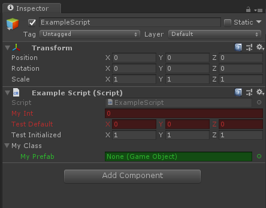

# RequiredAttribute

Use this if you want to warn your users about variables that have not been initialized.

Especially useful if you work with forgetful people! :)

## Getting Started

For a quick import into an existing project, just get the [UnityPackage](RequiredAttributePackage.unitypackage).

The RequiredAttribute folder is an empty project with only the plugin imported and some examples! :)

## Prerequisites

There are absolutely no prerequisites to this plugin.

Everything comes into a few files (and most of them are used for demo).

## Code Usage

```csharp
[Required]
public int myInt; // Works with any type

[Required]
public Vector3 testDefault; // I said, ANY type!

[Required]
public Vector3 testInitialized = Vector3.one; // Once it has been initialized, the color disappears

public MyClass myClass; // Works with custom types!

    
[System.Serializable]
public class MyClass
{
    [Required("40FF40")] // Define any color with its hex code!
    public GameObject myPrefab;
}
```

## Screenshots



## Notes

* Last tested with [Unity 2018.2.1f1](https://unity3d.com/unity/whatsnew/unity-2018.2.1).

## Authors

* **[Arthur Cousseau](https://www.linkedin.com/in/arthurcousseau/)**

## License

This project is licensed under the MIT License - see the [LICENSE.md](LICENSE.md) file for details

## Going further...

We could do many things on top of this.

For example:

- An option to specify a different default value than the type of the variable.
- An option to block the PlayMode, or even to prevent from building the game, if a variable has its default value.
